# Unlinger

**The work ended. Its processes should too.**

[简体中文](README.zh-CN.md) · [Getting started](docs/GETTING_STARTED.md) · [How it works](docs/ARCHITECTURE.md)

Unlinger observes abandoned browser-automation sessions on macOS and can reclaim a narrowly verified set of leftover processes. A native menu-bar App shows what is running, why a session is protected, and what cleanup actually achieved.

**Experimental developer preview, built from source.** The daemon defaults to **report-only**. Automatic cleanup requires a separately enabled service and every safety gate. There is no signed/notarized download, multi-day reliability claim, or general integration with every AI-agent task.

## What you can do

- **See browser leftovers and their explanation.** Native snapshots, explicit compatibility, protection reasons and redacted local history.
- **Track a command's browser lifetime.** `unlinger task run -- COMMAND` registers an exact command owner. Its compatible Playwright CLI sessions become candidates after the task ends; release alone never authorizes cleanup.
- **See actual process cleanup.** Completed receipts drive reclaimed-session/process counts and estimated memory impact. Repeated observations are compressed; they are not counted as cleanup.
- **Inspect disk residue.** Chrome code-sign clone count and logical size are visible. Disk cleanup is unavailable: the active policy deletes no profile, directory or runtime artifact.

| Surface | Current boundary |
| --- | --- |
| Platform | macOS 14+; Apple silicon verified; Intel/universal unverified |
| Browser | Chrome for Testing exactly `151.0.7922.34` or `152.0.7977.42` |
| Command-owned integration | Playwright CLI from `playwright-core` `1.63.0-alpha-2026-08-31`, with the issued session inherited unchanged |
| Other recognized families | agent-browser and Puppeteer; automatic eligibility requires a controllerless tree and every hard gate; no controlled field evidence for these families |
| Always protected | Ordinary Chrome, headed/manual or attached sessions, standard/shared/persistent profiles, unverified controllers and incomplete identity |

[Support truth](docs/SUPPORT.md) distinguishes recognition, automatic eligibility and field evidence.

## Try it without installing a service

You need Rust **1.98.0**, macOS command-line developer tools and Git. The App additionally needs **Swift 6.0+**; its bundle script uses `rg` (ripgrep).

```bash
git clone https://github.com/IndelibleVivi/unlinger.git
cd unlinger
cargo build --locked --release --workspace
./target/release/unlinger doctor --source-only
./target/release/unlinger scan --dry-run
./scripts/preview.sh
```

`preview.sh` runs one report-only reconciliation with its own temporary database, socket and lock, prints a redacted receipt, then removes only that temporary state. It does not install a LaunchAgent or send cleanup signals. Only protected sessions is an expected result when no verified abandoned session exists.

The [getting-started guide](docs/GETTING_STARTED.md) continues with an interactive isolated daemon, an executable command-lifetime example, optional service installation and uninstall. The [task guide](docs/TASKS.md) gives the exact browser configuration and integration contract.

## How cleanup earns permission



The daemon owns classification, durable task lifetime and cleanup authority. It checks exact process identity, browser version, ownership, active clients and profile protections, then requires the ordinary age/stability/abandonment gates. Enforcement also needs explicit mode authorization. Each signal is journalled and revalidated; a terminal receipt follows absence and revival checks. The App displays that result through one daemon-owned snapshot.

The [architecture guide](docs/ARCHITECTURE.md) explains these boundaries in English and Chinese and links the editable diagram source.

## Native App

```bash
swift test --package-path apps/UnlingerApp
apps/UnlingerApp/scripts/bundle.sh
open apps/UnlingerApp/build/Unlinger.app
```

The App connects to the separately installed daemon. Without one, it reports unavailable. The generated bundle is locally ad-hoc signed; it is not a distributable notarized release. It supports English and Simplified Chinese, a menu-bar popover and an ordinary Dock window. Quitting the App leaves an installed daemon running. See the [App guide](apps/UnlingerApp/README.md) for development previews and notification limits.

## Evidence and limits

The maintainer's reference installation has controlled task-owned CfT-152 cleanup receipts: two deliberately created sessions, 16 processes reclaimed, and matching App impact. Isolated full-timing task tests cover both exact CfT versions. These prove those cases; they do not establish unattended multi-day safety or broad browser support. [Current state](docs/current-state.md) separates source, CI, installed runtime and field evidence, including unresolved issues in the disabled artifact engine.

Normal runtime is local-only: no account, telemetry, cloud sync or normal-operation network calls. Raw process arguments and browser/profile paths remain transient; persisted history and diagnostic exports use typed redacted records. Building downloads dependencies. See [privacy](docs/PRIVACY.md) and [safety](docs/SAFETY.md).

## Documentation

| Reader's question | Guide |
| --- | --- |
| How do I try, install or remove it? | [Getting started](docs/GETTING_STARTED.md) |
| How does my script participate? | [Task-owned sessions](docs/TASKS.md) |
| Why is a session protected? | [Support](docs/SUPPORT.md), [signature packs](docs/SIGNATURES.md), [safety](docs/SAFETY.md) |
| Which component owns the result? | [Architecture](docs/ARCHITECTURE.md), [IPC](docs/IPC.md), [App contract](apps/UnlingerApp/Contract/README.md) |
| What was actually verified? | [Current state](docs/current-state.md), [acceptance levels](docs/PRE_V0_1_ACCEPTANCE.md), [Field Lab](docs/FIELDLAB.md) |
| How do managed upgrades and rollback work? | [Installed-service runbook](docs/INSTALLED_DOGFOOD.md) |
| What is the longer product contract? | [Working specification](docs/SPEC.md), [implementation coverage](docs/IMPLEMENTATION_PLAN.md) |

## Licensing and provenance

Software, scripts, rules and functional fixtures use [SUL-1.0](LICENSE). Documentation, architecture diagrams and project image assets use [CC BY-NC-SA 4.0](LICENSE-DOCUMENTATION.md). This is **source-available**, not OSI open source: SUL allows personal/noncommercial and internal business use, while distribution or provision to others must be free of charge and noncommercial. See [the scope map](LICENSING.md) and [material provenance](docs/PROVENANCE.md).
