# Architecture

This is the current private working diagram. It distinguishes implemented source flow from runtime activation; it is not yet the publication-grade bilingual architecture artifact required before a visibility change.

```mermaid
flowchart LR
    subgraph OS[macOS current-user boundary]
        PT[Process table]
        SIG[Exact same-user process signals]
    end

    subgraph OBS[Observation and authorization]
        SNAP[unlinger-macos<br/>libproc identity + sysctl argv]
        GRAPH[unlinger-core<br/>graph + incident model]
        RULES[unlinger-rules<br/>sessionization + protections]
        COOL[SQLite cooling ledger<br/>durable 90 s abandonment grace]
        GATES[Hard gate ledger<br/>two observations + exact identity]
    end

    subgraph MODE[Daemon activation boundary]
        REPORT[Report-only default]
        PLAN[Frozen cleanup plan]
        RECHECK[Fresh incident revalidation]
        EXEC[Primary TERM → member TERM<br/>→ exact-survivor KILL]
        REVIVE[Post-scan + bounded<br/>15/60 s revival checks]
    end

    subgraph LOCAL[Local observability]
        STORE[Redacted SQLite timeline<br/>14 d or 10,000 events]
        IPC[0600 Unix socket]
        CLI[CLI<br/>status history explain<br/>pause resume diagnostics]
    end

    PT --> SNAP --> GRAPH
    RULES --> GRAPH
    GRAPH --> COOL --> GATES
    GATES -->|all modes| REPORT
    REPORT --> STORE
    GATES -->|explicit enforce mode only| PLAN
    PLAN --> RECHECK
    RECHECK -->|all current facts still pass| EXEC
    EXEC --> SIG
    SIG --> REVIVE
    REVIVE --> STORE
    STORE --> IPC --> CLI
    CLI -->|pause / resume only| MODE
```

The enforcement branch exists in source but is not installed or activated on the ambient machine. `unlingerd` defaults to report-only; an explicit `--enforce` flag is required even for later isolated acceptance work.

The daemon currently provides startup and periodic reconciliation. launchd installation, exit dispatch sources, wake and memory-pressure triggers, runtime-artifact cleanup, universal packaging, signing/notarization, and release update/rollback remain outside the implemented source path.

Raw arguments, executable paths, frozen target identities, and the session fingerprint terminate inside transient observation/enforcement memory. The persistence boundary accepts only typed redacted observation records and cleanup receipts; IPC and diagnostics project those same records.
