# Architecture

This is the current private working diagram. It distinguishes implemented source flow from runtime activation; it is not yet the publication-grade bilingual architecture artifact required before a visibility change.

```mermaid
flowchart LR
    subgraph SERVICE[Per-user service source candidate]
        SVC[unlinger service<br/>install status restart-report-only<br/>accept-candidate rollback-candidate]
        TX[Durable install + acceptance transaction<br/>leased SQLite backup + report-only recovery]
        GEN[Sealed immutable generation<br/>CLI + daemon + manifest]
        LAUNCHD[launchd LaunchAgent<br/>exact PID and binary owner]
        SVC --> TX --> GEN --> LAUNCHD
    end

    subgraph TRIG[Scheduling hints]
        PERIODIC[60 s periodic fallback]
        EXIT[Watched process exit]
        WAKE[System wake]
        PRESSURE[Memory pressure]
        SCHED[Coalescing scheduler]
        PERIODIC --> SCHED
        EXIT --> SCHED
        WAKE --> SCHED
        PRESSURE -->|urgency only| SCHED
    end

    subgraph OS[macOS current-user boundary]
        PT[Process table + exact zombie status]
        BUNDLE[Exact app-bundle version]
        SIG[Exact same-user process signals]
        DAP[Targeted pathname-reference proof<br/>+ exact DevToolsActivePort unlink]
    end

    subgraph OBS[Observation and authorization]
        SNAP[Fresh unlinger-macos snapshot]
        GRAPH[unlinger-core identity graph]
        PACKS[Schema-v2 TOML packs]
        SESSION[Shared deterministic Rust sessionizer]
        GATES[Hard protections<br/>exact CfT 151/152 points + age 60 s]
        COOL[SQLite cooling ledger<br/>durable 90 s abandonment grace]
    end

    subgraph MODE[Daemon and enforcement]
        DAEMON[unlingerd]
        FIRST[First scan always report-only]
        LIFE[Durable requested/effective mode<br/>generation + instance + epoch]
        REPORT[Redacted report-only projection]
        PLAN[Frozen cleanup plan]
        RECHECK[Fresh exact revalidation]
        PREP[Durable PREPARED signal row]
        EXEC[Primary TERM → member TERM<br/>→ exact-survivor KILL]
        REVIVE[Post-scan + bounded<br/>15/60 s revival checks]
        APREP[Durable PREPARED artifact row]
    end

    subgraph LOCAL[Owner-private state and control]
        STORE[SQLite v7 spans + impact + journals<br/>event tokens + mutation receipts]
        RESIDUE[Typed Chrome clone observation<br/>logical bytes, never delete authority]
        IPC[0600 newline-delimited JSON socket<br/>bounded eight-worker server]
        PUBLIC[Schema v5 public DTO<br/>overview + impact/residue + ordinary commands]
        V4[Schema v4 transition<br/>prior overview shape]
        V3[Schema v3 compatibility<br/>existing frontend commands]
        V1[Schema v1 compatibility<br/>CLI + service transaction]
        V2[Schema v2 historical<br/>typed unsupported]
        INTERNAL[Service-only lifecycle controls<br/>exact generation + instance]
    end

    subgraph APP[Native menu-bar App]
        CLIENT[Strict single-attempt v5 client]
        JOURNAL[0600 pre-send mutation journal]
        STATE[Coalesced mapped state<br/>+ independent host routers]
        NOTICE[Bounded notification ledger<br/>local OS delivery]
        HOST[AppKit-owned status popover<br/>+ reusable ordinary window]
        JOURNAL --> CLIENT --> STATE --> NOTICE
        STATE --> HOST
        NOTICE --> HOST
    end

    LAUNCHD --> DAEMON --> FIRST --> SCHED
    PT --> SNAP
    BUNDLE --> SNAP
    SCHED --> SNAP --> GRAPH --> SESSION
    PACKS --> SESSION --> GATES --> COOL
    COOL --> REPORT --> STORE
    RESIDUE --> STORE
    STORE --> LIFE --> DAEMON
    COOL -->|confirmed + effective enforce| PLAN --> RECHECK --> PREP
    PREP --> STORE
    PREP -->|after durable commit| EXEC
    EXEC --> SIG --> REVIVE
    REVIVE -->|tree gone, no revival, exact DAP candidate| APREP
    APREP --> STORE
    APREP -->|after durable commit| DAP --> STORE
    STORE --> IPC --> PUBLIC
    IPC --> V4
    IPC --> V3
    STORE --> IPC --> V1
    IPC --> V2
    PUBLIC --> CLIENT
    SVC --> INTERNAL --> V1
```

`unlingerd` defaults to report-only when invoked directly. Managed source boots name a sealed generation and never receive `--enforce` in the plist. Every managed process begins with a signal-free report-only recovery/first-scan phase. A same-generation restart may carry durable enforce intent only for that exact generation; after recovery and a fresh first scan, it creates a new enforcement epoch and resets cooling before effective enforcement resumes. An open cleanup attempt or delivery-unknown retry block clears that intent and leaves the generation durably report-only. A new generation, explicit `Disarm`, explicit `BeginDrain`, or failed managed startup also clears it. Ordinary SIGTERM/SIGINT performs a clean process exit without pretending to be the service manager's explicit drain transaction.

The service CLI builds a new immutable generation, validates its files and manifest, records a durable transaction, drains the exact prior service, validates and snapshots SQLite state, and selects the candidate only at the report-only floor. Ready report-only acceptance is stable rather than momentary: `scan_in_progress` and `cleanup_in_progress` must both be false. The candidate then enters `CandidateReadyReportOnly`; its prior manifest/plist/database remain leased until explicit accept or rollback. A `DatabaseBackedUp` cut is treated conservatively because candidate selection files may already have been published. Rollback validates the immutable backup and sealed prior generation, persists `RollbackInProgress` before physical mutation, and replays only candidate/prior/mixed selection states owned by the transaction until the same snapshot and prior report-only selection are healthy. If lifecycle IPC is unavailable, the emergency path proves the selected binary/process identity before bootout. Offline enforce-intent clearing updates the compatible lifecycle row without opening the database through a current-schema migrator and verifies that `user_version` is unchanged.

The acceptance transaction uses `AcceptanceInProgress` as a pre-linearization state: recovery restores the prior report-only generation. Durable `Accepted` is the commit point; recovery then finishes cleanup rather than rolling back. While a ready lease is pending, install, uninstall and mode changes are blocked. Acceptance requires the exact healthy, quiescent ReadyReportOnly candidate, a report-only manifest and executable rollback material. `restart-report-only` preserves the lease but deliberately does not require the current instance to be healthy: exact selection plus valid rollback material and a report-only manifest are sufficient to recover an unloaded, PID-less, scanning or terminal-failed candidate into a fresh exact ReadyReportOnly instance. Real rollback/open points include generation 9 before generation 12, generation 13 before generation 15, and the SQLite-v7 candidate A generation 16 back to generation 15/v6. The same v7 candidate freshly reinstalled as generation 17 before repeat schema-v5 App/restart checks and acceptance. Generation 17 is active process-only with no pending lease.

`Failed` is terminal for one managed daemon instance. A later successful observation cannot reinterpret it as a first scan or turn it into ReadyReportOnly. An exact `Disarm` may retry the durable fail-close while preserving `Failed`, unhealthy, and not-ready; transaction recovery may then send exact `BeginDrain`, validate the resulting draining identity, boot out the captured process, and start a fresh report-only instance. Arm also checks the volatile lifecycle phase, so stale durable ReadyEnforce state cannot reopen a live signal gate after an in-memory fail-close. Generations 9 and 13 passed historical process/artifact transactions; generation 15 passed the CfT-151 process-only cleanup/restart transaction. Generation 17 passed its own install/rollback/App/restart lane and was later armed, but has no candidate-specific controlled signal receipt. Universal packaging, signing/notarization, release update/rollback, sustained dogfood, and broader field evidence remain open.

The scheduler uses native Dispatch process-exit sources, IOKit wake notifications, and Dispatch memory-pressure events as coalesced hints. Every hint causes a fresh full snapshot; it never authorizes cleanup or weakens a gate. A source failure is surfaced as degraded status and periodic reconciliation remains active. Pressure does not alter the 60-second candidate-age gate, exact browser version policy, durable abandonment grace, or cleanup threshold. The sustained-pressure notification threshold is deliberately unresolved, so aggregate ambiguous count is not a notification signal.

The sessionizer is one deterministic Rust algorithm parameterized by schema-v2 pack data. Current source and installed packs automatically admit only browser roots whose exact app-bundle facts match `com.google.chrome.for.testing` version `151.0.7922.34` or `152.0.7977.42`; this is a two-point allowlist, not a range. Any controller-bearing candidate is protected because controller version is not yet verified. Pack markers rank and reconstruct candidates but cannot introduce an alternate graph traversal or signal strategy.

Runtime-artifact cleanup exists as a dormant DAP-only engine. Current source and installed policy-version `0.4.0` packs set `devtools_active_port = false`, so neither analyzer emits an artifact candidate and process-only enforcement writes no artifact action. If a future owner-approved pack re-enables it, the engine freezes at most one `DevToolsActivePort` identity before signaling, waits for the exact tree and revival window to clear, completes the targeted pathname-reference and current-user argv proof, writes a PREPARED artifact action, and then uses exact parent/file identities plus an exclusive same-directory quarantine before unlink. It never deletes a profile or directory; sockets and PID files are not automatically eligible.

The source daemon separately observes the exact current-user Chrome `code_sign_clone` residue family at a bounded interval. The macOS adapter accepts only the expected clone directory shape, rejects symlinks, unexpected entries and incomplete traversal, and reports logical regular-file bytes with an explicitly incomplete physical-reclaim reference. This observation is persisted as a typed latest fact and projected in schema v5 with `automatic_cleanup_eligible: false`; it does not enter the artifact cleanup plan, expose a pathname, or create any deletion authority.

The macOS adapter no longer walks every file descriptor of every same-UID process to prove DAP absence. That approach cannot be complete for an ordinary daemon because unrelated protected Apple agents may deny descriptor metadata and ordinary close/reuse churn can invalidate an enumerated FD. Instead it brackets Darwin's targeted `proc_listpidspath(PROC_ALL_PIDS, exact_path)` query with exact frozen parent/file validation, treats only a negative return as lookup failure, and performs a complete current-user `KERN_PROCARGS2` argv pass. It queries the canonical pathname before quarantine and the actual quarantine pathname after the atomic rename, so an already-open inode remains discoverable under its new name. Any incomplete metadata, arguments, targeted query, or path identity fails closed.

This is not a claim that the final deletion race is fully closed. Two known P2 residuals remain: daemon death after the canonical-to-quarantine rename can strand the exact private quarantine entry, and a same-UID actor can still attempt a swap between the final `fstatat` pathname check and `unlinkat`. Controlled generation-9 and generation-13 field runs produced successful live DAP-removal receipts with the dormant path; those point results do not resolve either race or authorize re-enabling artifact eligibility.

Ordinary IPC commands and service lifecycle controls share the owner-private socket but not the same typed authority surface. Source schema v5 contains strict public status/history/incident/roster/diagnostics DTOs plus mutation status, ordinary pause/resume, retry and exact-incident protect/unprotect, and one atomic browser overview. That overview captures status+roster under one source boundary, owns phase precedence, typed compatibility/coverage, the embedded-rule support catalog and exact-event settlement, then adds independently durable cleanup impact and typed observe-only storage residue. Schema v5 history/detail exposes server-owned observation spans. Schema v4 remains a transition endpoint with its prior overview/response shapes and no v5-only fields; schema v3 preserves its existing commands but rejects the overview. All frontend schemas strip process/service identities and derive capabilities from the same policy used for transaction authorization. Schema v2 is historical and rejected. `Arm`, `Disarm`, and `BeginDrain` exist only in schema v1 and remain bound to the exact activation generation and daemon instance.

Every frontend mutation is written to an App-local crash-durable journal before connect/send, then the daemon commits state, durable revision and typed receipt in one immediate transaction. Exact replay precedes lifecycle denial; same ID plus different canonical arguments conflicts; pruning rotates receipt namespace atomically. Any post-send untrusted result remains unresolved and the App uses read-only mutation status rather than resending. The App fetches status, history and the canonical browser snapshot concurrently; it does not fetch roster for browser composition or perform a coherence retry. Its coalesced refresh generation prevents old results from overwriting new state. The overview and history mappers run once per state transition and publish stored presentation values only when they change. History index rows now represent terminal cleanup outcomes; observation repetition is carried by daemon-owned spans inside detail. Stable public event tokens drive history identity and duplicate-avoiding local notifications; the first trusted refresh baselines retained history.

Every socket request still uses one connection and one response. Default and service clients make one 15-second attempt; up to eight accepted connections are served concurrently, each with a 3-second read/write bound. Slow history or a partial peer therefore cannot head-of-line block all later control traffic. The managed field harness polls only read-only exact-incident `Explain` on a separate worker so native absence sampling is independent. Raw arguments, executable/profile paths, frozen target identities, and session fingerprints terminate inside transient observation/enforcement memory. SQLite, IPC, CLI, diagnostics, App journals and notification routes retain or project only typed redacted records.

macOS can leave an exited child visible in the process table as a zombie while `kill(pid, 0)` still reports that the PID exists. Snapshot and exact lookup therefore use `KERN_PROC_PID` status as the fallback authority: a confirmed `SZOMB` is treated as gone, excluded from live incidents, and not counted as unreadable coverage. Other read failures still fail closed.
