# Architecture

This is the current private working diagram. It distinguishes implemented source flow from runtime activation; it is not yet the publication-grade bilingual architecture artifact required before a visibility change.

```mermaid
flowchart LR
    subgraph SERVICE[Per-user service source candidate]
        SVC[unlinger service<br/>install status set-mode uninstall]
        TX[Durable install transaction<br/>SQLite backup + report-only recovery]
        GEN[Sealed immutable generation<br/>CLI + daemon + manifest]
        LAUNCHD[launchd LaunchAgent<br/>exact PID and binary owner]
        SVC --> TX --> GEN --> LAUNCHD
    end

    subgraph TRIG[Scheduling hints]
        PERIODIC[60 s periodic fallback]
        EXIT[Watched process exit]
        WAKE[System wake]
        PRESSURE[Memory pressure]
        SCHED[Coalescing scheduler]
        PERIODIC --> SCHED
        EXIT --> SCHED
        WAKE --> SCHED
        PRESSURE -->|urgency only| SCHED
    end

    subgraph OS[macOS current-user boundary]
        PT[Process table + exact zombie status]
        BUNDLE[Exact app-bundle version]
        SIG[Exact same-user process signals]
        DAP[Targeted pathname-reference proof<br/>+ exact DevToolsActivePort unlink]
    end

    subgraph OBS[Observation and authorization]
        SNAP[Fresh unlinger-macos snapshot]
        GRAPH[unlinger-core identity graph]
        PACKS[Schema-v2 TOML packs]
        SESSION[Shared deterministic Rust sessionizer]
        GATES[Hard protections<br/>exact CfT point + age 60 s]
        COOL[SQLite cooling ledger<br/>durable 90 s abandonment grace]
    end

    subgraph MODE[Daemon and enforcement]
        DAEMON[unlingerd]
        FIRST[First scan always report-only]
        LIFE[Durable requested/effective mode<br/>generation + instance + epoch]
        REPORT[Redacted report-only projection]
        PLAN[Frozen cleanup plan]
        RECHECK[Fresh exact revalidation]
        PREP[Durable PREPARED signal row]
        EXEC[Primary TERM → member TERM<br/>→ exact-survivor KILL]
        REVIVE[Post-scan + bounded<br/>15/60 s revival checks]
        APREP[Durable PREPARED artifact row]
    end

    subgraph LOCAL[Owner-private state and control]
        STORE[SQLite v6 timeline + journals<br/>event tokens + mutation receipts]
        IPC[0600 newline-delimited JSON socket<br/>bounded eight-worker server]
        PUBLIC[Schema v3 public DTO<br/>ordinary frontend commands only]
        V1[Schema v1 compatibility<br/>CLI + service transaction]
        V2[Schema v2 historical<br/>typed unsupported]
        INTERNAL[Service-only lifecycle controls<br/>exact generation + instance]
    end

    subgraph APP[Native menu-bar App]
        CLIENT[Strict single-attempt v3 client]
        JOURNAL[0600 pre-send mutation journal]
        STATE[Coalesced state + shared router]
        NOTICE[Bounded notification ledger<br/>local OS delivery]
        JOURNAL --> CLIENT --> STATE --> NOTICE
    end

    LAUNCHD --> DAEMON --> FIRST --> SCHED
    PT --> SNAP
    BUNDLE --> SNAP
    SCHED --> SNAP --> GRAPH --> SESSION
    PACKS --> SESSION --> GATES --> COOL
    COOL --> REPORT --> STORE
    STORE --> LIFE --> DAEMON
    COOL -->|confirmed + effective enforce| PLAN --> RECHECK --> PREP
    PREP --> STORE
    PREP -->|after durable commit| EXEC
    EXEC --> SIG --> REVIVE
    REVIVE -->|tree gone, no revival, exact DAP candidate| APREP
    APREP --> STORE
    APREP -->|after durable commit| DAP --> STORE
    STORE --> IPC --> PUBLIC
    STORE --> IPC --> V1
    IPC --> V2
    PUBLIC --> CLIENT
    SVC --> INTERNAL --> V1
```

`unlingerd` defaults to report-only when invoked directly. Managed source boots name a sealed generation and never receive `--enforce` in the plist. Every managed process begins with a signal-free report-only recovery/first-scan phase. A same-generation restart may carry durable enforce intent only for that exact generation; after recovery and a fresh first scan, it creates a new enforcement epoch and resets cooling before effective enforcement resumes. An open cleanup attempt or delivery-unknown retry block clears that intent and leaves the generation durably report-only. A new generation, explicit `Disarm`, explicit `BeginDrain`, or failed managed startup also clears it. Ordinary SIGTERM/SIGINT performs a clean process exit without pretending to be the service manager's explicit drain transaction.

The service CLI builds a new immutable generation, validates its files and manifest, records a durable transaction, drains the exact prior service, validates and backs up SQLite state, selects the candidate, and accepts it only when launchd PID, IPC PID, generation, executable, private permissions, lifecycle identity, and effective mode agree. Ready report-only acceptance is stable rather than momentary: `scan_in_progress` and `cleanup_in_progress` must both be false. Crash/failure recovery restores a report-only floor. If lifecycle IPC is unavailable during that bounded recovery, the emergency path first proves the exact manifest/plist/binary/process identity, waits for launchd and the captured daemon identity to disappear, clears enforce intent through an exact-generation offline store API, and accepts only a runtime-proven ReadyReportOnly replacement.

That install transaction does not yet provide a post-ready acceptance rollback lease. Source SQLite v6 cannot be reopened by the installed generation-9 v5 binary after an App acceptance failure. The pre-v0.1 v3 lane is therefore source/isolated only until prior manifest/plist/v5 database material remains leased through explicit accept/rollback and a real old-binary rollback/open test passes.

`Failed` is terminal for one managed daemon instance. A later successful observation cannot reinterpret it as a first scan or turn it into ReadyReportOnly. An exact `Disarm` may retry the durable fail-close while preserving `Failed`, unhealthy, and not-ready; transaction recovery may then send exact `BeginDrain`, validate the resulting draining identity, boot out the captured process, and start a fresh report-only instance. Arm also checks the volatile lifecycle phase, so stale durable ReadyEnforce state cannot reopen a live signal gate after an in-memory fail-close. Generation 9 has passed this transactional report-only recovery boundary and one full managed process/artifact/restart transaction, then returned to stable report-only. Universal packaging, signing/notarization, release update/rollback, sustained dogfood, and broader field evidence remain open.

The scheduler uses native Dispatch process-exit sources, IOKit wake notifications, and Dispatch memory-pressure events as coalesced hints. Every hint causes a fresh full snapshot; it never authorizes cleanup or weakens a gate. A source failure is surfaced as degraded status and periodic reconciliation remains active. Pressure does not alter the 60-second candidate-age gate, exact browser version policy, durable abandonment grace, or cleanup threshold. The sustained-pressure notification threshold is deliberately unresolved, so aggregate ambiguous count is not a notification signal.

The sessionizer is one deterministic Rust algorithm parameterized by schema-v2 pack data. Current packs automatically admit only browser roots whose exact app-bundle facts match `com.google.chrome.for.testing` version `151.0.7922.34`; any controller-bearing candidate is protected because controller version is not yet verified. Pack markers rank and reconstruct candidates but cannot introduce an alternate graph traversal or signal strategy.

Runtime-artifact cleanup is DAP-only in the 0.1 source candidate. The engine freezes at most one `DevToolsActivePort` identity before signaling, waits for the exact tree and revival window to clear, completes the targeted pathname-reference and current-user argv proof, writes a PREPARED artifact action, and then uses exact parent/file identities plus an exclusive same-directory quarantine before unlink. It never deletes a profile or directory; sockets and PID files are not yet automatically eligible.

The macOS adapter no longer walks every file descriptor of every same-UID process to prove DAP absence. That approach cannot be complete for an ordinary daemon because unrelated protected Apple agents may deny descriptor metadata and ordinary close/reuse churn can invalidate an enumerated FD. Instead it brackets Darwin's targeted `proc_listpidspath(PROC_ALL_PIDS, exact_path)` query with exact frozen parent/file validation, treats only a negative return as lookup failure, and performs a complete current-user `KERN_PROCARGS2` argv pass. It queries the canonical pathname before quarantine and the actual quarantine pathname after the atomic rename, so an already-open inode remains discoverable under its new name. Any incomplete metadata, arguments, targeted query, or path identity fails closed.

This is not a claim that the final deletion race is fully closed. Two known P2 residuals remain: daemon death after the canonical-to-quarantine rename can strand the exact private quarantine entry, and a same-UID actor can still attempt a swap between the final `fstatat` pathname check and `unlinkat`. One controlled generation-9 field run produced a successful live DAP-removal receipt with the current path; that point result does not resolve either race or authorize broader artifact eligibility.

Ordinary IPC commands and service lifecycle controls share the owner-private socket but not the same typed authority surface. Schema v3 contains strict public status/history/incident/roster/diagnostics DTOs plus mutation status and ordinary pause/resume, retry and exact-incident protect/unprotect. It strips process/service identities, exposes exact readiness/freshness and derives capabilities from the same policy used for transaction authorization. Schema v2 is historical and rejected. `Arm`, `Disarm`, and `BeginDrain` exist only in schema v1 and remain bound to the exact activation generation and daemon instance.

Every v3 mutation is written to an App-local crash-durable journal before connect/send, then the daemon commits state, durable revision and typed receipt in one immediate transaction. Exact replay precedes lifecycle denial; same ID plus different canonical arguments conflicts; pruning rotates receipt namespace atomically. Any post-send untrusted result remains unresolved and the App uses read-only mutation status rather than resending. The App's coalesced refresh generation prevents old results from overwriting new state. Stable public event tokens drive history identity and duplicate-avoiding local notifications; the first trusted refresh baselines retained history.

Every socket request still uses one connection and one response. Default and service clients make one 15-second attempt; up to eight accepted connections are served concurrently, each with a 3-second read/write bound. Slow history or a partial peer therefore cannot head-of-line block all later control traffic. The managed field harness polls only read-only exact-incident `Explain` on a separate worker so native absence sampling is independent. Raw arguments, executable/profile paths, frozen target identities, and session fingerprints terminate inside transient observation/enforcement memory. SQLite, IPC, CLI, diagnostics, App journals and notification routes retain or project only typed redacted records.

macOS can leave an exited child visible in the process table as a zombie while `kill(pid, 0)` still reports that the PID exists. Snapshot and exact lookup therefore use `KERN_PROC_PID` status as the fallback authority: a confirmed `SZOMB` is treated as gone, excluded from live incidents, and not counted as unreadable coverage. Other read failures still fail closed.
